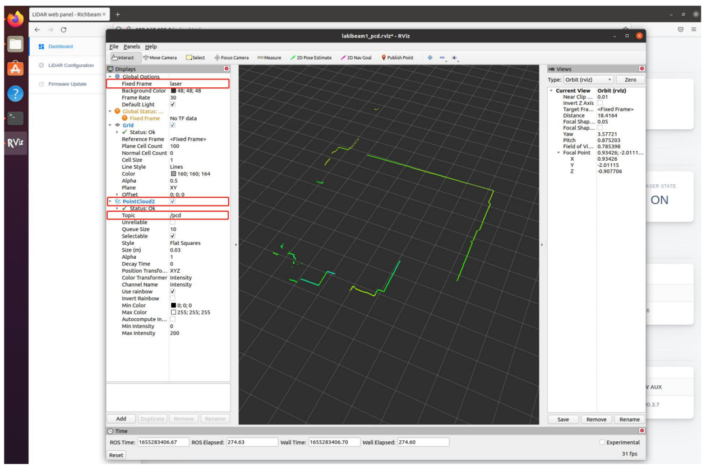

[中文版本使用说明](<https://github.com/RichbeamTechnology/Lakibeam_ROS1_Driver/blob/lorabeam/README_CN.md>)

# 1 About the Driver

Lorabeam ROS1 Drvier is the software development kit for: LoraBeam LiDAR manufactured by Richbeam (Beijing) Technology. After launched, the Driver will monitor UDP packets from Lidar, parse data and publish point clouds frames into ROS under topic: /scan or topic: /pcd.

# 2 Environment and Dependencies

System environment requirement: Linux + ROS  
Recommanded: Ubuntu 16.04 - with ROS kinetic desktop-full installed or  
Ubuntu 18.04 - with ROS melodic desktop-full installed or  
Ubuntu 20.04 - with ROS noetic desktop-full installed.  

Check resources on http://ros.org for installation guide.

# 3 Installation
## 3.1 Create the workspace for ROS1 Driver
```
cd~
mkdir -p catkin_ws/src
```
## 3.2 Build Lorabeam ROS1 Driver
```
cd catkin_ws/src
git clone -b lorabeam https://github.com/RichbeamTechnology/Lakibeam_ROS1_Driver.git
cd ~/catkin_ws
catkin_make
```

# 4 Configure PC and LiDAR IP Address

While Connecting via RJ45 cable and DC power supply, for the default lorabeam, it is configured the "192.168.8.2" as its own IP address, and the "192.168.8.1" as its destination PC IP address. So we need set the PC static IP as "192.168.8.1" and the net mask as "255.255.255.0", while the gateway address is not necessary. After configuration, we can use "ifconfig" command to check if the IP is work.

# 5 Launch File

Before receiving data from sensor, we should configure parameters in launch file if needed. The configurable parameters are shown in the table below:

| Parameter name     | Instruction     | 
| -------- | -------- |
| inverted | Invert the sensor, "true" is inverted. |
| hostip | Destination IP address, monitoring to all IP address when set to 0.0.0.0 |
| port | Monitoring port, must be same with port number set on web server when using dual sensors in one PC |
| angle_offset | Point cloud rotation angle around Z-axes, can be set to a negative number |
| scanfreq | Scan frequency, range: 10, 15, 20, 25, 30 |
| laser_enable | range: true, false |
| scan_range_start | range: 45°~315° |
| scan_range_stop | range: 45°~315°, The scan_range_stop must be greater than the scan_range_start |


# 6 View the Real Time Data
1. Connect the Lorabeam to your PC via RJ45 cable and DC power supply, and power on it.
2. We have provided several example launch files, such as "lakibeam1_scan.launch" and "lakibeam1_scan_view.launch" under /launch. To start the LaserScan node, we can run the launch file to view the real time point cloud.
```
cd ~/catkin_ws
source devel/setup.bash
roslaunch lakibeam1 lakibeam1_scan.launch
(run LaserScan node)
roslaunch lakibeam1 lakibeam1_scan_view.launch
(run LaserScan node in Rviz)
```
The real time point cloud data under LaserScan in Rviz is shown in the picture below:


3. While using launch file to start PointCloud2 node, we can run the launch file “lakibeam1_pcd.launch” or “lakibeam1_pcd_view.launch” under /launch to view the real time point cloud data. Open a terminal:
```
cd ~/catkin_ws
source devel/setup.bash
roslaunch lakibeam1 lakibeam1_pcd.launch
(run LaserScan node)
roslaunch lakibeam1 lakibeam1_pcd_view.launch
(run LaserScan node in Rviz)
```
The real time point cloud data under LaserScan in Rviz is shown in the picture below:

